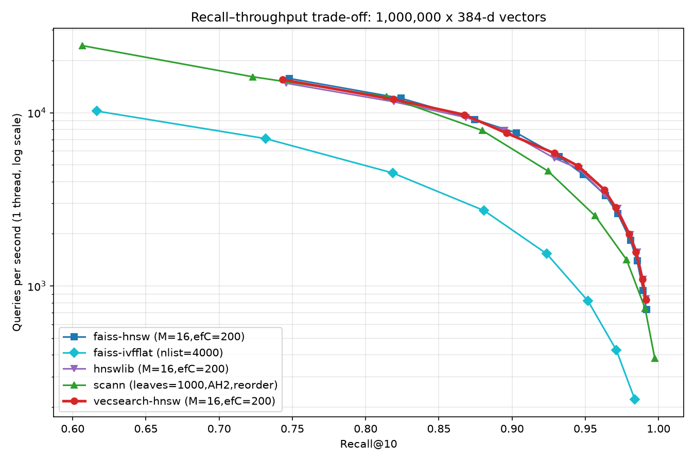
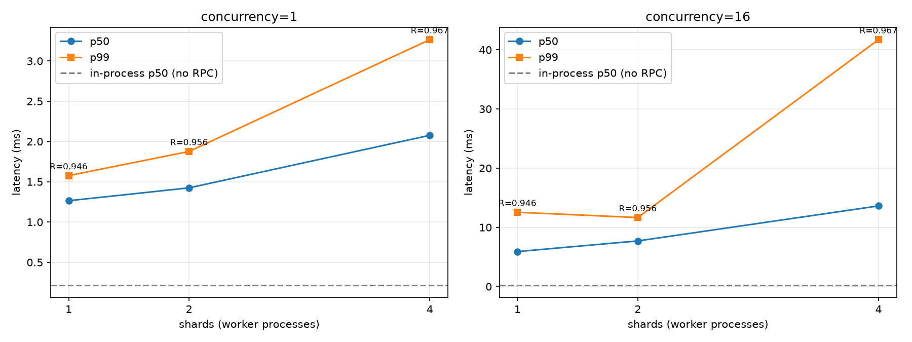
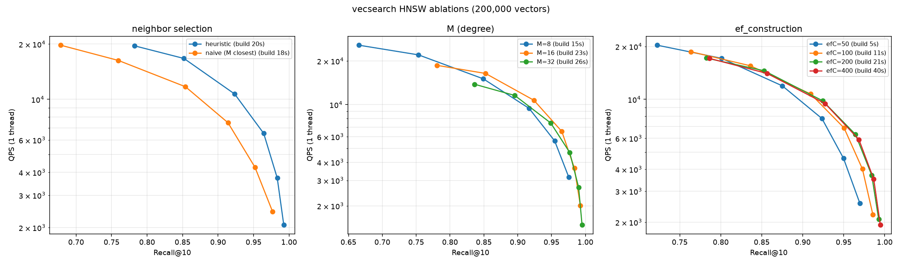
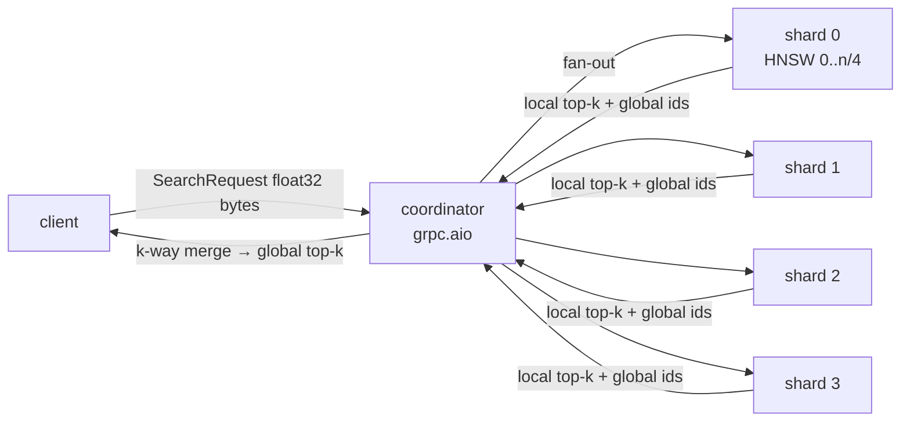

# vecsearch — HNSW vector search in C++, benchmarked against FAISS and ScaNN

HNSW (Hierarchical Navigable Small World) graphs in C++17 with pybind11 bindings, benchmarked on 1M customer-support tweet embeddings against hnswlib, FAISS and ScaNN, and served as a sharded gRPC service.

[](https://github.com/Manojkaipu/vecsearch/actions/workflows/ci.yml)

## Results

1,000,000 base vectors plus 10,000 held-out queries, sampled from the 2.52M unique tweets in Kaggle's "Customer Support on Twitter" and embedded with all-MiniLM-L6-v2 (384-d, cosine). Measured on a laptop: Intel Core Ultra 7 256V (8 threads), WSL2 Ubuntu with 7.7 GB of RAM.

### Recall@10 vs QPS (one query thread)


| library | build (s) | index (MB) | QPS @ R=0.90 | QPS @ R=0.95 | QPS @ R=0.99 |
|---|---|---|---|---|---|
| **vecsearch** | 166 | 1599 | 5,841 | **3,593** | 831 |
| hnswlib | 168 | 1606 | 5,458 | 3,370 | **843** |
| faiss-hnsw | 184 | 1602 | **7,642** | 3,333 | 730 |
| scann | **29** | 1655 | 4,596 | 2,542 | 742 |
| faiss-ivfflat | 99 | 1478 | 1,534 | 819 | — |

With the same M=16 and ef_construction=200, vecsearch stays within 0.01 recall of hnswlib and FAISS at every ef, with comparable throughput. The "QPS @ 0.90" column is lumpy because each library's sweep points land on different recalls; faiss-hnsw reaches 0.903 at ef=32, while vecsearch hits 0.896 there. ScaNN builds about 6x faster, is clearly ahead only below about 0.75 recall, and is the only library to reach 0.997.

### Latency vs shard count


ef=64, k=10, shards pinned to disjoint cores. Latency is milliseconds per request, measured at the client.

| setup | p50 (1 in flight) | p99 (1 in flight) | p50 (16 in flight) | p99 (16 in flight) | QPS (16 in flight) | recall@10 |
|---|---|---|---|---|---|---|
| in-process, no RPC | 0.21 | 0.36 | 0.21 | 0.37 | 4,571 | 0.946 |
| gRPC, 1 shard | 1.26 | 1.58 | 5.90 | 12.5 | 2,636 | 0.946 |
| gRPC, 2 shards | 1.42 | 1.88 | 7.70 | 11.7 | 2,049 | 0.956 |
| gRPC, 4 shards | 2.08 | 3.26 | 13.6 | 41.7 | 1,052 | 0.967 |

### Ablations (200k-vector subset)


Recall@10 at ef=64:
* **Neighbor selection:** the diversity heuristic reaches 0.965, against 0.914 for keeping the M closest. At the same recall, the heuristic lets queries use a much smaller ef.
* **M:** 8 gives 0.915, 16 gives 0.964, and 32 gives 0.977. Going from 8 to 32 roughly doubles build time and lowers QPS at each ef.
* **ef_construction:** going from 50 to 400 raises recall from 0.924 to 0.969, and build time grows roughly in proportion. The gain above 200 is small.

## Architecture



| layer | files |
|---|---|
| C++ core | `include/vecsearch/{distance,brute_force,hnsw}.h`, `src/*.cpp` |
| Python bindings | `python/bindings.cpp`, `python/vecsearch/` (GIL released during build/search) |
| Benchmarks | `bench/prepare_data.py → ground_truth.py → run_benchmarks.py → plot.py`, `bench/ablation.py` |
| Distributed | `distributed/search.proto`, `build_shards.py`, `shard_worker.py`, `coordinator.py`, `cluster.py`, `latency_bench.py` |
| Engineering | `tests/cpp` (GoogleTest), `tests/python` (pytest), `.github/workflows/ci.yml`, `Dockerfile`, `docker-compose.yml` |

## Implementation notes

* **Layers:** every vector sits on layer 0 with up to 2M links. A vector reaches level l with probability M^-l, so each layer up has about M times fewer nodes.
* **Search:** a greedy walk from the entry point down to layer 1, then a beam search of width `ef` on layer 0.
* **Insert:** descend to the new node's level, then on each of its layers run a beam search with `ef_construction`. Neighbors are picked with the diversity heuristic from the paper (Algorithm 4), links go both ways, and any neighbor that overflows is re-pruned.
* **Performance:** AVX2/FMA distance kernels with a scalar fallback, epoch-tagged visited lists pooled across threads, and flat `uint32` adjacency for layer 0.
* **Parallel build:** one mutex per node, and never two locks held at once. TSan runs in CI.
* **Correctness:** recall is always measured against exact search. `BruteForceIndex` is itself cross-checked against FAISS `IndexFlatIP`.

## Reproduce

Linux or WSL2. Embedding 1M tweets on a laptop CPU takes about 2 hours, and the rest of the pipeline about 40 minutes.

```bash
pip install . -r requirements-bench.txt
make test tsan

pip install -r requirements-embed.txt
python bench/prepare_data.py --csv twcs.csv --limit 1000000 --out data/tweets
# or: python bench/prepare_data.py --embeddings my_embeddings.npy --out data/tweets

make gt bench plot ablate
make dist dist-load plot-dist
```

Docker (4 shard containers + coordinator):
```bash
python distributed/build_shards.py --data data/tweets --shards 4 --out indexes/tweets_4shards
docker build -t vecsearch . && docker compose up
```

## Benchmark methodology
* Follows ann-benchmarks: indexes are built on all cores, queries run on one thread, and each point is the best of 2 runs. Recall@10 is measured against exact top-10.
* All three HNSW libraries use M=16 and ef_construction=200, with inner product on L2-normalized vectors (i.e. cosine).
* ScaNN uses num_leaves ≈ √N, anisotropic hashing (2 dims per block, threshold 0.2) and exact re-ranking. Its sweep is over (leaves_to_search, pre_reorder_num_neighbors).
* The 10,000 queries are held out of the index.

## Reading the shard numbers
All shards here share one 8-thread laptop, so sharding can only add cost:
* **Why p50 barely improves:** HNSW search cost grows roughly with log n, so a shard a quarter of the size is only a bit faster.
* **Why the tail grows:** every query waits for the slowest shard plus an extra hop through the Python coordinator. That's why p50 rises 1.26 → 2.08 ms and p99 under load 12.5 → 41.7 ms from 1 to 4 shards.
* **Why throughput under load drops:** from 2,636 to 1,052 QPS, because 4 shards end up with 2 threads each.
* **Why recall goes up:** each shard returns its own top-k found with ef=64, so the merge sees more candidates.

The case for sharding is holding more data than one machine's RAM, and adding throughput when each shard gets its own machine. This setup measures neither. The in-process row shows that gRPC and the Python coordinator account for about 1 ms of the 1.26 ms single-shard p50.

## How I used AI tools
I used Claude (via Claude Code) for:
* the repository layout, the CMake/pybind11/CI/Docker boilerplate and the benchmark harness
* getting the full benchmark running on my Windows laptop: WSL2 setup, dependencies, and a pipeline script that pauses whenever the laptop is unplugged
* cleaning up comments and writing this README from the result CSVs

I chose to benchmark a 1M-tweet sample instead of all 2.52M, so the run fits in laptop memory and finishes in under 3 hours.

Mistakes it made, found by reviewing its work afterwards:
* **Wrong results folder.** It launched a nearly 3-hour run without a dry run. WSL exports `NAME=<hostname>`, which overrode the Makefile's `NAME ?= tweets`, so the results went to the wrong folder. The Makefile now uses a plain `=`.
* **Misread progress.** It took buffered log output for a stalled embedding job that was actually on schedule. The progress file the script writes was the reliable signal.
* **Deleted a chart.** A clean-up step deleted `ablations.png`, which only `make ablate` regenerates.
* **Unreliable battery check.** The "never on battery" rule was enforced with a Windows battery field that misreports on this laptop, until two readings contradicted each other.
* **Overstated results.** It said vecsearch was within 0.005 recall of FAISS; the real gap is up to 0.0071. It said ScaNN wins below 0.9 recall; ScaNN is only clearly ahead below about 0.75.

Checks I rely on:
* Recall is always measured against exact search.
* Every number in this README was checked against `results/tweets/*.csv`.
* After any change, the C++ tests, Python tests and `make smoke smoke-dist` are re-run before a number is trusted.

## Limitations
* No deletes or in-place updates.
* float32 only. There's no quantization, which is where ScaNN's low-recall speed comes from.
* The Python gRPC coordinator costs about 1 ms per request; a C++ server would remove most of that.
* No replicas or hedged requests.
