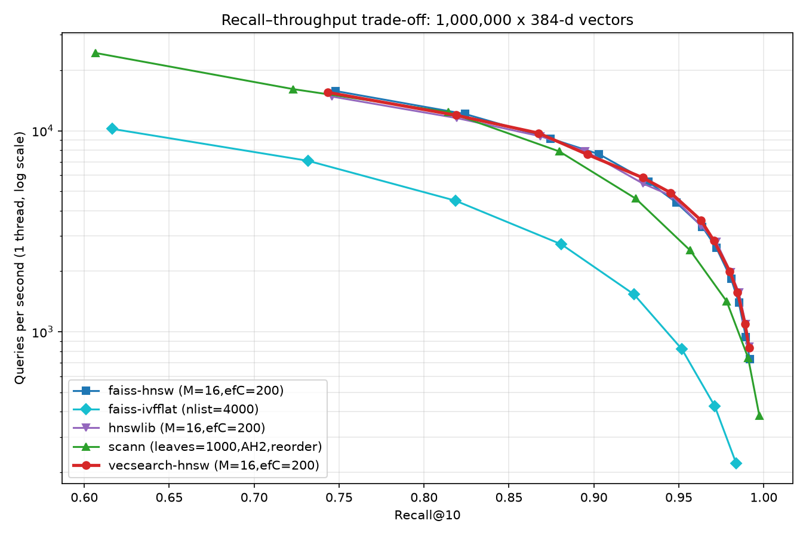
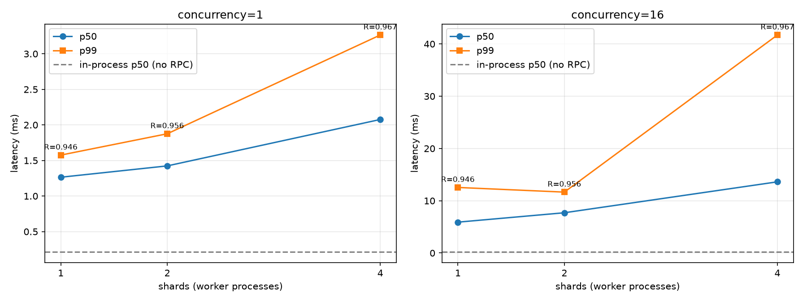
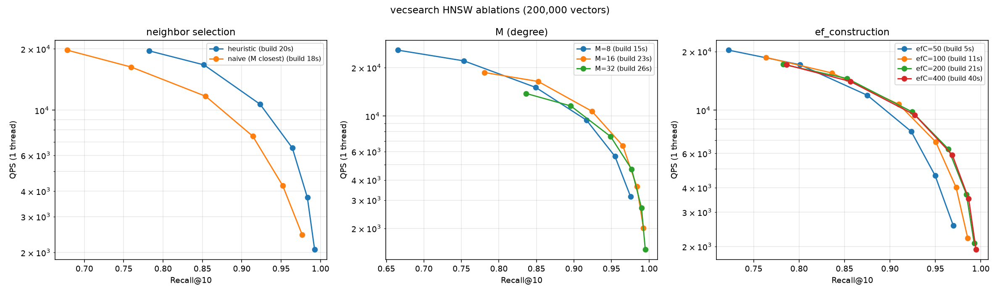
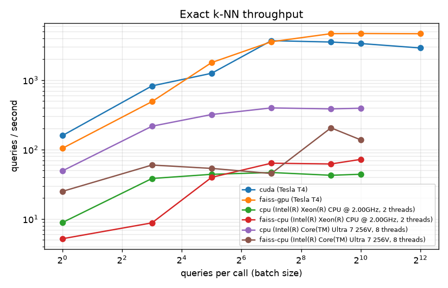
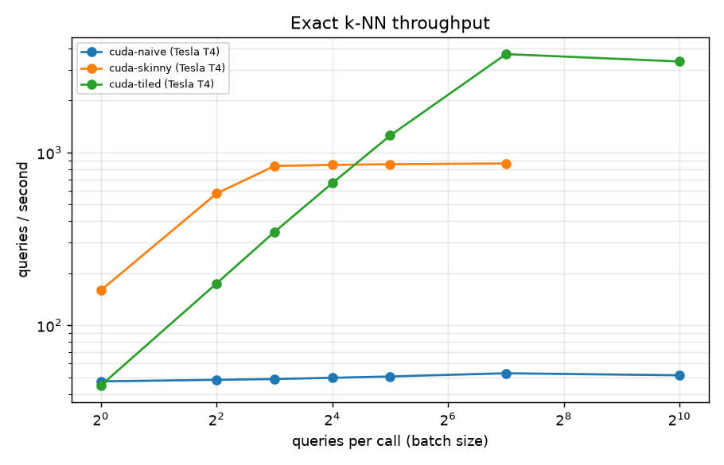
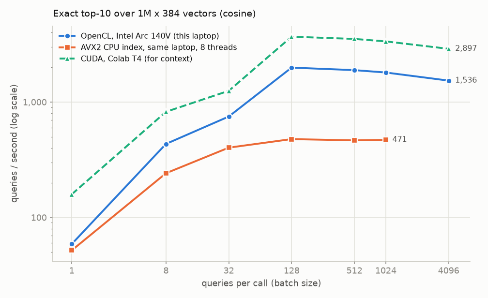
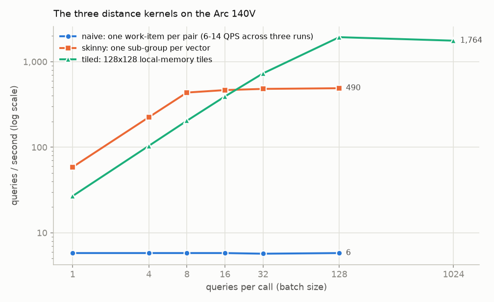
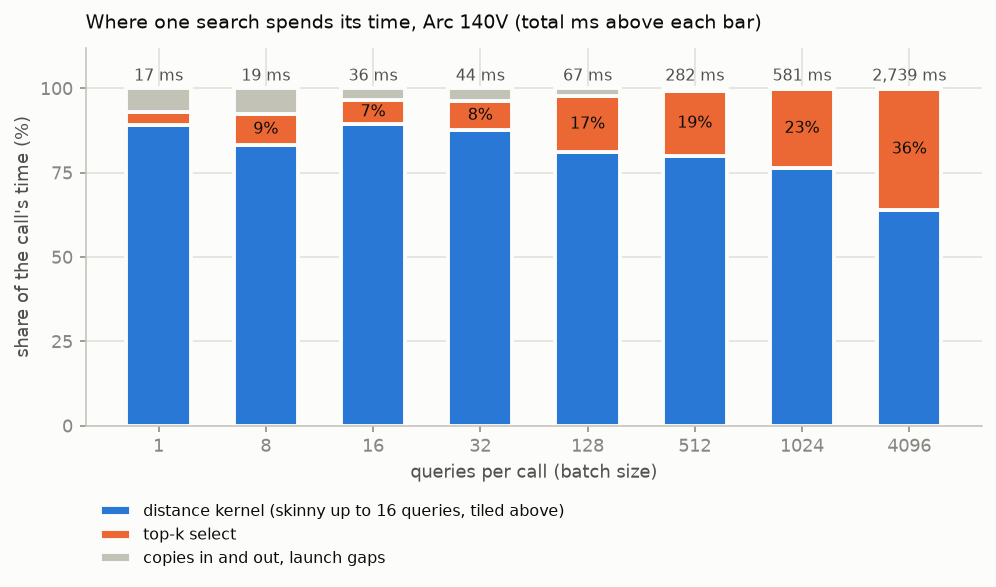
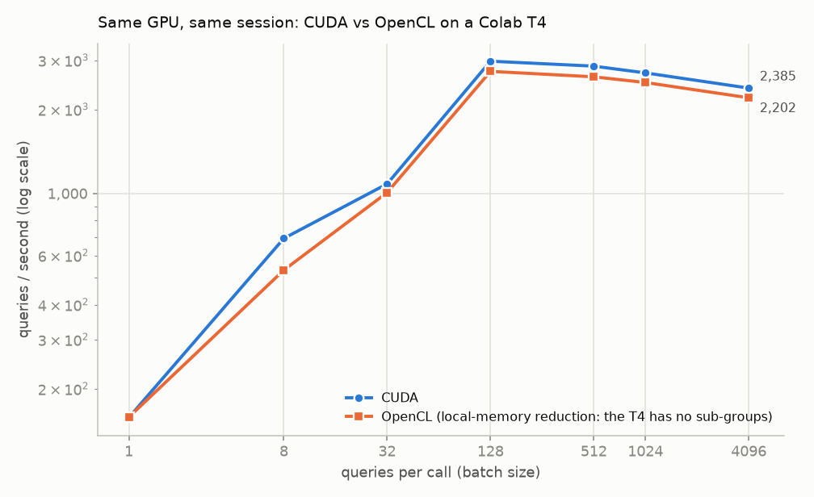
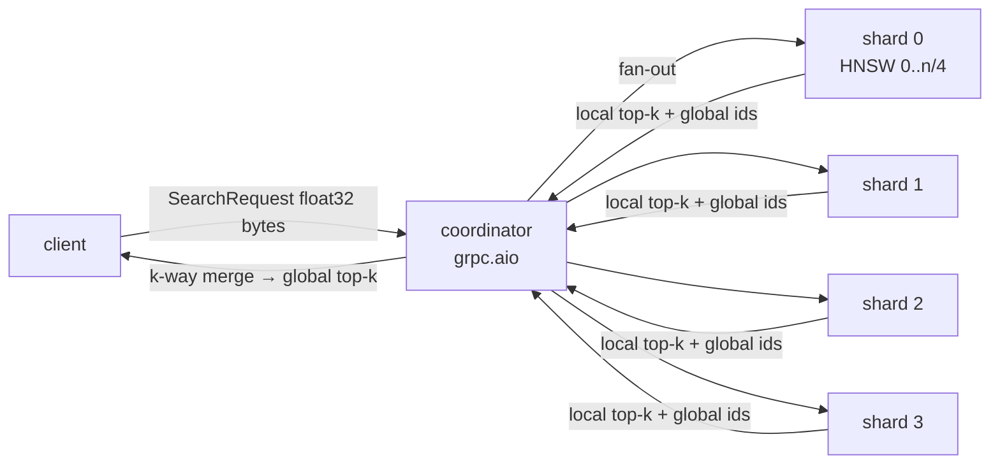

# vecsearch — HNSW vector search in C++, benchmarked against FAISS and ScaNN

HNSW (Hierarchical Navigable Small World) graphs in C++17 with pybind11 bindings, benchmarked on 1M customer-support tweet embeddings against hnswlib, FAISS and ScaNN, and served as a sharded gRPC service. Also includes a BM25 inverted index, filtered graph search, reciprocal rank fusion for hybrid retrieval, and CUDA and OpenCL kernels for exact search on a GPU, with the OpenCL port run on an Intel GPU and a quantization study of two models with OpenVINO.

[](https://github.com/Manojkaipu/vecsearch/actions/workflows/ci.yml)

## Results

1,000,000 base vectors plus 10,000 held-out queries, sampled from the 2.52M unique tweets in Kaggle's "Customer Support on Twitter" and embedded with all-MiniLM-L6-v2 (384-d, cosine). Measured on a laptop: Intel Core Ultra 7 256V (8 threads), WSL2 Ubuntu with 7.7 GB of RAM.

### Recall@10 vs QPS (one query thread)


| library | build (s) | index (MB) | QPS @ R=0.90 | QPS @ R=0.95 | QPS @ R=0.99 |
|---|---|---|---|---|---|
| **vecsearch** | 166 | 1599 | 5,841 | **3,593** | 831 |
| hnswlib | 168 | 1606 | 5,458 | 3,370 | **843** |
| faiss-hnsw | 184 | 1602 | **7,642** | 3,333 | 730 |
| scann | **29** | 1655 | 4,596 | 2,542 | 742 |
| faiss-ivfflat | 99 | 1478 | 1,534 | 819 | — |

With the same M=16 and ef_construction=200, vecsearch stays within 0.01 recall of hnswlib and FAISS at every ef, with comparable throughput. The "QPS @ 0.90" column is lumpy because each library's sweep points land on different recalls; faiss-hnsw reaches 0.903 at ef=32, while vecsearch hits 0.896 there. ScaNN builds about 6x faster, is clearly ahead only below about 0.75 recall, and is the only library to reach 0.997.

### Latency vs shard count


ef=64, k=10, shards pinned to disjoint cores. Latency is milliseconds per request, measured at the client.

| setup | p50 (1 in flight) | p99 (1 in flight) | p50 (16 in flight) | p99 (16 in flight) | QPS (16 in flight) | recall@10 |
|---|---|---|---|---|---|---|
| in-process, no RPC | 0.21 | 0.36 | 0.21 | 0.37 | 4,571 | 0.946 |
| gRPC, 1 shard | 1.26 | 1.58 | 5.90 | 12.5 | 2,636 | 0.946 |
| gRPC, 2 shards | 1.42 | 1.88 | 7.70 | 11.7 | 2,049 | 0.956 |
| gRPC, 4 shards | 2.08 | 3.26 | 13.6 | 41.7 | 1,052 | 0.967 |

### Ablations (200k-vector subset)


Recall@10 at ef=64:
* **Neighbor selection:** the diversity heuristic reaches 0.965, against 0.914 for keeping the M closest. At the same recall, the heuristic lets queries use a much smaller ef.
* **M:** 8 gives 0.915, 16 gives 0.964, and 32 gives 0.977. Going from 8 to 32 roughly doubles build time and lowers QPS at each ef.
* **ef_construction:** going from 50 to 400 raises recall from 0.924 to 0.969, and build time grows roughly in proportion. The gain above 200 is small.

### Filtered and hybrid search

Measured in support-rag, a question-answering system built on this library, over 892,800 conversation chunks from the same tweet corpus (M=16, ef=128, k=10, one thread). Each row filters to one company's chunks. Recall is against exact search over just the allowed chunks.

| allowed chunks | post-filter recall | in-graph recall | in-graph p50 / p99 | exact scan p50 |
|---|---|---|---|---|
| 105,998 (11.9%) | 0.980 | 0.983 | 0.46 / 14.1 ms | 11.6 ms |
| 17,287 (1.9%) | 0.995 | 0.995 | 0.38 / 1.0 ms | 2.7 ms |
| 3,732 (0.42%) | 0.978 | 0.996 | 0.30 / 4.4 ms | 0.62 ms |
| 1,663 (0.19%) | 0.919 | 0.992 | 1.9 / 40.6 ms | 0.39 ms |
| 166 (0.02%) | 0.814 | 0.999 | 43.9 / 432 ms | 0.25 ms |
| 127 (0.01%) | 0.880 | 1.000 | 672 / 754 ms | 0.24 ms |

* **Post-filtering** (search unfiltered for 10x as many results, then drop the rest) is what you get from any ANN library without filter support. It loses up to 19% recall on small companies.
* **In-graph filtering** keeps recall high at every selectivity. Filtered-out nodes are still walked through, so the graph stays connected. But below about 0.2% of the corpus, the search visits most of the graph before it finds ten allowed nodes.
* **Exact scan** of the allowed ids wins below a few thousand chunks. `search(..., exact_below=n)` switches to it automatically. With n=5,000 here, all ten companies tested (0.01% to 12% of the corpus) get recall ≥ 0.975 and p50 ≤ 0.62 ms.

On support-rag's 86 hand-reviewed questions, fusing BM25 and vector results with RRF finds the source conversation in the top 10 for 66% of questions. That compares with 55% for vector search and 50% for BM25 alone.

```python
import vecsearch as vs

bm25 = vs.BM25Index()                        # Okapi BM25, Lucene idf, UTF-8-safe tokenizer
bm25.add(texts)
ids_b, _ = bm25.search("battery drains after update", k=100, filter=mask)
ids_v, _ = hnsw.search(query_vec, k=100, ef=128, filter=mask, exact_below=5000)
top, scores = vs.rrf([ids_v[0], ids_b[0]], k=10)
```

### Exact search on a GPU


Exact top-10 over 1M x 384 vectors (cosine, the tweet benchmark's shape), timed per call including copying queries in and results out. The GPU is Colab's free Tesla T4. Every row returns the same top 10 as the CPU index (recall 1.0).

Queries per second by batch size:

| | 1 | 8 | 32 | 128 | 512 | 1024 | 4096 |
|---|---|---|---|---|---|---|---|
| **vecsearch CUDA, T4** | **159** | **824** | 1,253 | **3,691** | 3,530 | 3,358 | 2,897 |
| FAISS-GPU, T4 | 104 | 490 | **1,787** | 3,560 | **4,658** | **4,681** | **4,649** |
| vecsearch AVX2, laptop (8 threads) | 49 | 217 | 319 | 397 | 385 | 394 | — |
| FAISS-CPU, laptop (8 threads) | 25 | 60 | 54 | 45 | 205 | 138 | — |
| vecsearch AVX2, Colab (2 vCPUs) | 9 | 38 | 44 | 47 | 43 | 44 | — |

* **Against the AVX2 code:** the GPU is 3.2x faster for one query and 9.3x faster at batch 128, against the laptop's 8 threads. Against the 2 vCPUs on the same Colab machine it is 79x, but that baseline is too weak to mean much.
* **Against FAISS-GPU:** 1.5x faster for one query and 1.7x for 8, level at 128, then 72-76% of its throughput at 512-1024 and 62% at 4096. FAISS uses cuBLAS for the matrix multiply. I haven't profiled where the tiled kernel loses ground at large batches.
* **Small batches are bandwidth-bound.** One query reads all 1.5 GB of vectors in 6.3 ms, about 244 GB/s, or 76% of the T4's 320 GB/s.
* **Large batches are compute-bound.** At batch 128 the GPU sustains about 2.8 TFLOPS end to end; FAISS reaches 3.6 at batch 1024.

The CPU baseline is not the single-threaded `search()`. `search_batch` splits the data across threads, keeps ~256 KB of vectors in L2 while every query passes over them, and computes four queries per vector load with AVX2/FMA. It reaches about 300 GFLOPS on the laptop.

#### Kernel ablation (T4)


| kernel | idea | QPS at batch 1 | 16 | 128 | 1024 |
|---|---|---|---|---|---|
| naive | the CPU loop ported directly: one thread per (query, vector), uncoalesced reads | 47 | 50 | 53 | 51 |
| skinny | one warp per vector, coalesced float4 reads, each vector read once for 8 queries | **159** | **848** | 864 | — |
| tiled | 128x128 shared-memory tiles, an 8x8 register block per thread, prefetching | 45 | 665 | **3,713** | **3,366** |

`search(..., method="auto")` uses skinny up to 16 queries and tiled above that. Top-k is a second kernel. Each thread keeps a sorted register list of its best k, and the lists are bitonic-sorted in shared memory. Large batches go through the data in chunks so the distance block stays under 512 MB.

```python
gpu = vs.GpuBruteForceIndex(384, metric="ip")   # pip install with CMAKE_ARGS=-DVECSEARCH_BUILD_CUDA=ON
gpu.add(xb)
ids, dists = gpu.search(queries, k=10)           # k <= 128
```

### OpenCL and OpenVINO

The three distance kernels and the top-k kernel are ported to OpenCL C, so the same exact search runs on the laptop's integrated Intel Arc 140V, and on POCL, which runs the same kernels on a CPU. That is what CI uses to check the GPU code on every commit. Everything below is measured on the Arc 140V in WSL2 on AC power (Intel Core Ultra 7 256V), with the CUDA section's data (1M x 384, cosine, k=10) and sweep. Recall against the CPU index is 1.0 in every row. The T4 line on the chart is from a Colab session of its own (see the portability section), not from the CUDA section's table.



Queries per second, median of three full sweeps:

| | 1 | 8 | 32 | 128 | 512 | 1024 | 4096 |
|---|---|---|---|---|---|---|---|
| **OpenCL, Arc 140V** | 59 | 434 | 750 | **1,991** | 1,893 | 1,806 | 1,536 |
| AVX2 CPU index, same laptop, 8 threads | 52 | 242 | 403 | 478 | 466 | 471 | — |
| OpenCL speedup over that CPU | 1.1x | 1.8x | 1.9x | **4.2x** | 4.1x | 3.8x | — |

* **Correctness:** results are compared with the CPU index the way the CUDA tests do it (distances within rtol 1e-4 / atol 1e-3, at least 99% of ids equal, rows sorted), plus a stricter check: every returned id's distance is recomputed on the CPU and must match the reported one. 104 GoogleTest and 181 pytest cases cover k larger than the dataset, batch 1, a 5,000-query batch, sizes either side of the 128-wide tile, every k bucket and paged storage. They pass on the Arc 140V and, in GitHub Actions, on POCL.
* **What translated:** warps became sub-groups (`sub_group_reduce_add`, with no assumption that a sub-group is 32 wide), shared memory became local memory, and pointer offsets became kernel arguments. Two things needed more than a rename. Intel caps a single allocation at 1 GiB, and 1M x 384 floats are 1.5 GB, so the index stores its data in pages. And a device without sub-group support gets a local-memory reduction instead, which the tests also run.
* **Memory-bound or compute-bound** (ceilings measured on this GPU with plain kernels: 104 GB/s read, 3.6 TFLOP/s FP32):





| batch | kernel | bound by | distance kernel reaches |
|---|---|---|---|
| 1-8 | skinny | memory | 94-96% of the read ceiling (about 100 GB/s) |
| 32 | tiled | compute | 69% of the FP32 peak, because it computes a full 128-query tile |
| 128-4096 | tiled | compute | 48-50% of the FP32 peak (1.8 TFLOP/s at batch 128) |

Small batches are limited by reading the 1.5 GB of vectors, and the kernel already streams them at nearly the measured ceiling. Large batches are limited by compute, but the tiled kernel reaches only half of the peak. The top-k select is the weak spot: it takes 17% of a batch-128 call and 36% of a batch-4096 call, reading the distance block at about 17 GB/s. A fused or faster select is the next speed-up, not the matrix multiply.

#### The cost of portability, on the same T4

The same index built with both backends on one Colab T4, in one session (`bench/opencl_colab.ipynb`). NVIDIA's OpenCL driver reports no sub-group support, so the OpenCL side ran the local-memory reduction instead of sub-groups; this measures that path. Recall against the CPU index is 1.0 throughout.



| queries per second | 1 | 8 | 32 | 128 | 512 | 1024 | 4096 |
|---|---|---|---|---|---|---|---|
| CUDA | 158 | 691 | 1,083 | 2,978 | 2,858 | 2,704 | 2,385 |
| OpenCL | 158 | 532 | 1,008 | 2,738 | 2,618 | 2,498 | 2,202 |
| **OpenCL as a share of CUDA** | 100% | **77%** | 93% | 92% | 92% | 92% | 92% |

* **Portability costs about 8% at batch 32 and above**, and nothing at batch 1, where both kernels are limited by the same memory bandwidth (89% of a measured 273 GB/s in both).
* **The tiled kernel gives up only 3-5%** (97% of CUDA at batch 128, 95% at 1024). The skinny kernel gives up 17-23% at batches 4-128 (78% at batch 8). The skinny kernel is the one that uses a warp reduction, so its loss is consistent with the local-memory reduction costing more than warp shuffles. The Arc 140V shows the same direction: its sub-group version is 29% faster than the fallback at batch 8. The T4 can't separate the two, since it has no sub-group path to compare.
* **The naive kernel is identical** (about 50 QPS in both), as expected for code that is the same loop.
* Two runs of the same OpenCL path on the T4 (`opencl` and `opencl-nosg`, which are the same code there) differ by about 4%, so differences below that are noise.
* This session's CUDA numbers are 14-20% below the CUDA table above at batch 8 and up (2,978 against 3,691 QPS at batch 128) and equal at batch 1; that table was measured on another day. Colab T4s vary, which is why the comparison uses only same-session numbers.

#### Running the models at lower precision

MiniLM (the embedding model support-rag uses) and Qwen2.5-1.5B-Instruct, exported with optimum-intel and run on OpenVINO's GPU device. The embedding table searches support-rag's real 892,800-chunk index with its 96 evaluation questions; "top-10 overlap" is the share of the full-precision model's top 10 chunks the quantized model also returns.

| MiniLM | top-10 overlap with FP32 | source conversation in top 10 | query p50 | chunks/s (batch 32) | model |
|---|---|---|---|---|---|
| FP32, PyTorch on CPU | reference | 54.7% | 7.9 ms | 45 | |
| FP16, GPU | 1.000 | 54.7% | 2.8 ms | 830 | 43 MB |
| INT8, GPU | 0.975 | 54.7% | 3.5 ms | 792 | 22 MB |
| INT4, GPU | 0.792 | 51.2% | 3.5 ms | 677 | 17 MB |

| Qwen2.5-1.5B | GPU memory | decode | prefill (1.8k-token prompt) | agrees with FP16's verdicts | flagged answers caught |
|---|---|---|---|---|---|
| FP16 | 3,201 MB | 27.6 tok/s | 6,556 tok/s | — | 6 of 7 |
| INT8 | 1,626 MB | 47.0 tok/s | 7,420 tok/s | 86% | 5 of 7 |
| INT4 | 1,026 MB | 66.2 tok/s | 6,716 tok/s | 63% | 2 of 7 |

* **INT8 is nearly free; INT4 is not.** INT8 halves the LLM's memory (3.2 to 1.6 GB) and the embedding model keeps 97.5% of its top 10. INT4 (the optimum-intel default for Qwen: AWQ and scale estimation calibrated on wikitext2, group size 128) is 3.1x smaller and 2.4x faster than FP16, but changes 37% of the model's verifier verdicts and loses a fifth of the embedding model's top 10.
* **On the GPU, quantizing the small model doesn't make it faster.** FP16 is the fastest MiniLM there; INT8 only pays off on the CPU (87 vs 56 chunks/s).
* **The small model is not a usable verifier at any precision.** Run as support-rag's verifier on its 86 stored answers, it agrees with the original verifier on 34% (FP16), 45% (INT8) and 55% (INT4) of them, and Cohen's kappa is about 0 in every case. Always answering "supported" would agree on 92%. The agreement rises as precision drops only because the model drifts toward the majority answer while catching fewer of the 7 answers the original flagged. The verdicts are not exactly repeatable on the GPU either (INT4's agreement was 49/86 on one run and 47/86 on the next).

`python bench/validate.py` runs the correctness tests, the benchmark and both model checks, and writes a markdown report. Each check has a threshold in `bench/validation_thresholds.json`, set just below what was measured, and the exit code is 1 if any fails. The full numbers and the exact commands are in `NOTES.md`.

#### What didn't work

* **My first compute ceiling was wrong.** An FMA microbenchmark written with `float4` chains measured 1.3 TFLOP/s, and the tiled kernel then measured 1.4, above the "ceiling". Intel's compiler turns that loop into code about 2.8x slower than the same loop on scalars (3.6 TFLOP/s). A first fix returned only one lane, so the compiler deleted the rest and reported an impossible 10-27 TFLOP/s.
* **The first prefill timings were cache hits.** Timing one prompt repeatedly reported 1,834 tokens in 44 ms (42,000 tokens/s) because the pipeline reuses the KV cache of a repeated prefix. Each timed run now has a unique prompt.
* **The naive kernel isn't repeatable on this GPU:** 14, 9 and 6 QPS across three runs of the same code, while the other two kernels moved by under 10%.
* **The cost of portability was measured on one T4 only, and with the fallback path.** NVIDIA's OpenCL has no sub-groups, so the sub-group kernels were never compared with CUDA's warp shuffles on the same GPU.
* **INT4 means one recipe.** Plain round-to-nearest 4-bit weights were not tried, and all results are from one laptop whose GPU and CPU share a power budget (run-to-run spread was up to 7% at batch 1, and up to 15% from heat).

```python
gpu = vs.OpenCLBruteForceIndex(384, metric="ip")   # CMAKE_ARGS=-DVECSEARCH_BUILD_OPENCL=ON
gpu.add(xb)
ids, dists = gpu.search(queries, k=10)              # same interface as GpuBruteForceIndex; vs.opencl_devices() lists devices
```

## Architecture


```mermaid
flowchart LR
  C[client] -->|SearchRequest float32 bytes| CO[coordinator<br/>grpc.aio]
  CO -->|fan-out| S0[shard 0<br/>HNSW 0..n/4]
  CO --> S1[shard 1]
  CO --> S2[shard 2]
  CO --> S3[shard 3]
  S0 & S1 & S2 & S3 -->|local top-k + global ids| CO
  CO -->|k-way merge → global top-k| C
```

| layer | files |
|---|---|
| C++ core | `include/vecsearch/{distance,brute_force,hnsw,bm25}.h`, `src/*.cpp` |
| CUDA | `include/vecsearch/gpu_brute_force.h`, `src/gpu_brute_force.cu`, `bench/gpu_bench.py`, `bench/gpu_colab.ipynb` |
| OpenCL | `include/vecsearch/opencl_brute_force.h`, `src/opencl_brute_force.cpp`, `src/opencl/kernels.cl`, `bench/{roofline,opencl_roofline,opencl_profile}.py`, `bench/opencl_colab.ipynb` |
| OpenVINO | `bench/openvino/` (export, speed and memory, quality), `bench/validate.py`, `bench/validation_thresholds.json` |
| Python bindings | `python/bindings.cpp`, `python/vecsearch/` (GIL released during build/search) |
| Benchmarks | `bench/prepare_data.py → ground_truth.py → run_benchmarks.py → plot.py`, `bench/ablation.py` |
| Distributed | `distributed/search.proto`, `build_shards.py`, `shard_worker.py`, `coordinator.py`, `cluster.py`, `latency_bench.py` |
| Engineering | `tests/cpp` (GoogleTest), `tests/python` (pytest), `.github/workflows/ci.yml`, `Dockerfile`, `docker-compose.yml` |

## Implementation notes

* **Layers:** every vector sits on layer 0 with up to 2M links. A vector reaches level l with probability M^-l, so each layer up has about M times fewer nodes.
* **Search:** a greedy walk from the entry point down to layer 1, then a beam search of width `ef` on layer 0.
* **Insert:** descend to the new node's level, then on each of its layers run a beam search with `ef_construction`. Neighbors are picked with the diversity heuristic from the paper (Algorithm 4), links go both ways, and any neighbor that overflows is re-pruned.
* **Performance:** AVX2/FMA distance kernels with a scalar fallback, epoch-tagged visited lists pooled across threads, and flat `uint32` adjacency for layer 0.
* **Parallel build:** one mutex per node, and never two locks held at once. TSan runs in CI.
* **Filters:** a byte mask over ids. Search still expands rejected nodes but never returns them. At or below `exact_below` allowed ids it scans them exactly instead.
* **BM25:** postings are stored per term in doc-id order and scored term-at-a-time into a per-thread accumulator. Only the touched entries are reset, so a query never clears a 900k-entry array. Scores are tested against a direct transcription of the formula.
* **Correctness:** recall is always measured against exact search. `BruteForceIndex` is itself cross-checked against FAISS `IndexFlatIP`.

## Reproduce

Linux or WSL2. Embedding 1M tweets on a laptop CPU takes about 2 hours, and the rest of the pipeline about 40 minutes.

```bash
pip install . -r requirements-bench.txt
make test tsan

pip install -r requirements-embed.txt
python bench/prepare_data.py --csv twcs.csv --limit 1000000 --out data/tweets
# or: python bench/prepare_data.py --embeddings my_embeddings.npy --out data/tweets

make gt bench plot ablate
make dist dist-load plot-dist
```

GPU: open `bench/gpu_colab.ipynb` in Colab with a T4 runtime and run all (about 15 minutes). It builds with `CMAKE_ARGS=-DVECSEARCH_BUILD_CUDA=ON`, runs the GPU tests and writes `results/gpu/colab*.csv`. The laptop rows come from `python bench/gpu_bench.py --backends cpu,faiss-cpu --out results/gpu/laptop.csv`.

Docker (4 shard containers + coordinator):
```bash
python distributed/build_shards.py --data data/tweets --shards 4 --out indexes/tweets_4shards
docker build -t vecsearch . && docker compose up
```

## Benchmark methodology
* Follows ann-benchmarks: indexes are built on all cores, queries run on one thread, and each point is the best of 2 runs. Recall@10 is measured against exact top-10.
* All three HNSW libraries use M=16 and ef_construction=200, with inner product on L2-normalized vectors (i.e. cosine).
* ScaNN uses num_leaves ≈ √N, anisotropic hashing (2 dims per block, threshold 0.2) and exact re-ranking. Its sweep is over (leaves_to_search, pre_reorder_num_neighbors).
* The 10,000 queries are held out of the index.

## Reading the shard numbers
All shards here share one 8-thread laptop, so sharding can only add cost:
* **Why p50 barely improves:** HNSW search cost grows roughly with log n, so a shard a quarter of the size is only a bit faster.
* **Why the tail grows:** every query waits for the slowest shard plus an extra hop through the Python coordinator. That's why p50 rises 1.26 → 2.08 ms and p99 under load 12.5 → 41.7 ms from 1 to 4 shards.
* **Why throughput under load drops:** from 2,636 to 1,052 QPS, because 4 shards end up with 2 threads each.
* **Why recall goes up:** each shard returns its own top-k found with ef=64, so the merge sees more candidates.

The case for sharding is holding more data than one machine's RAM, and adding throughput when each shard gets its own machine. This setup measures neither. The in-process row shows that gRPC and the Python coordinator account for about 1 ms of the 1.26 ms single-shard p50.

## How I used AI tools
I used Claude (via Claude Code) for:
* the repository layout, the CMake/pybind11/CI/Docker boilerplate and the benchmark harness
* getting the full benchmark running on my Windows laptop: WSL2 setup, dependencies, and a pipeline script that pauses whenever the laptop is unplugged
* cleaning up comments and writing this README from the result CSVs

I chose to benchmark a 1M-tweet sample instead of all 2.52M, so the run fits in laptop memory and finishes in under 3 hours.

Mistakes it made, found by reviewing its work afterwards:
* **Wrong results folder.** It launched a nearly 3-hour run without a dry run. WSL exports `NAME=<hostname>`, which overrode the Makefile's `NAME ?= tweets`, so the results went to the wrong folder. The Makefile now uses a plain `=`.
* **Misread progress.** It took buffered log output for a stalled embedding job that was actually on schedule. The progress file the script writes was the reliable signal.
* **Deleted a chart.** A clean-up step deleted `ablations.png`, which only `make ablate` regenerates.
* **Unreliable battery check.** The "never on battery" rule was enforced with a Windows battery field that misreports on this laptop, until two readings contradicted each other.
* **Overstated results.** It said vecsearch was within 0.005 recall of FAISS; the real gap is up to 0.0071. It said ScaNN wins below 0.9 recall; ScaNN is only clearly ahead below about 0.75.

Checks I rely on:
* Recall is always measured against exact search.
* Every number in this README was checked against `results/tweets/*.csv`.
* After any change, the C++ tests, Python tests and `make smoke smoke-dist` are re-run before a number is trusted.

## Limitations
* No deletes or in-place updates.
* float32 only. There's no quantization, which is where ScaNN's low-recall speed comes from.
* The Python gRPC coordinator costs about 1 ms per request; a C++ server would remove most of that.
* No replicas or hedged requests.
* The GPU indexes (CUDA and OpenCL) are exact search only, on one GPU, with k <= 128 and data that fits in GPU memory. At large batches it reaches 62-76% of FAISS-GPU's throughput.
